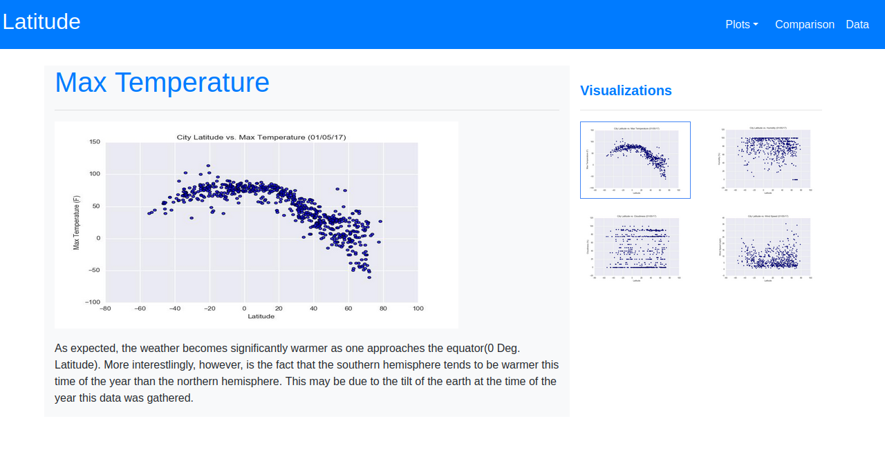
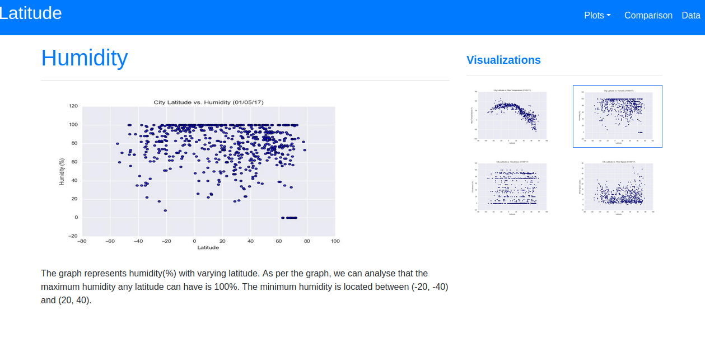
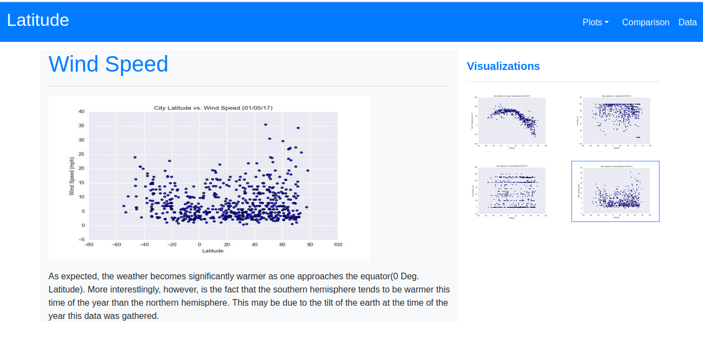
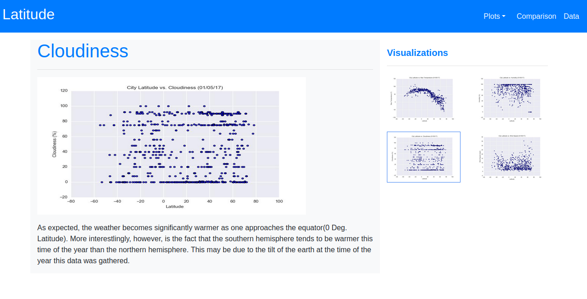

# Web-Design-Challenge
Web Visualization Dashboard

## Overview:
Data is more powerful when we share it with others! Created a dashboard uisng HTML and CSS to showcase the analysis done.

### Website:
Created a visualization dashboard website using HTML and CSS for the weather data.

The website consists of 7 pages total including:

A landing page containing:
    An explanation of the project.
    Links to each visualizations page.

Four visualization pages, each with:
    A descriptive title and heading tag.
    The plot/visualization itself for the selected comparison.
    A paragraph describing the plot and its significance.

A "Comparisons" page that:
    Contains all of the visualizations on the same page so we can easily visually compare them.
    Uses a bootstrap grid for the visualizations.
    The grid has two visualizations across on screens medium and larger, and 1 across on extra-small and small screens.

A "Data" page that:
    Displays a responsive table containing the data used in the visualizations.
    The table is a bootstrap table component.
    The data was exported from the .csv file as HTML using pandas.

The website, at the top of every page, has a navigation menu that:
    Has the name of the site on the left of the nav which allows users to return to the landing page from any page.
    Contains a dropdown on the right of the navbar named "Plots" which provides links to each individual visualization page.
    Provides two more links on the right: "Comparisons" which links to the comparisons page, and "Data" which links to the data page.
    Is responsive (using media queries)

## Website Deployed :
The website is deployed to <a href="https://jamilabarasa.github.io/Web-Design-Challenge/" target="_blank">Github Pages</a>

## Visualizations:

## Tech Environment Used:

HTML, CSS, Bootstrap, VSCode, GitHub, GitHub pages.